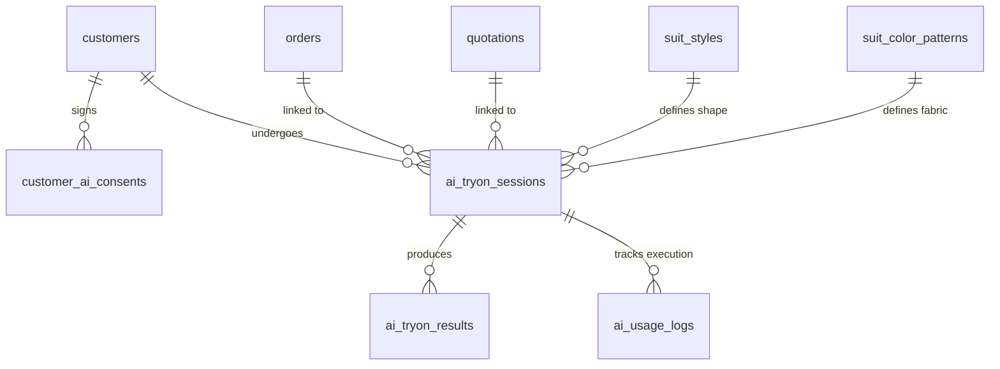

# Architecture Design — AI Virtual Try-On Studio

This document details the software architecture, database schema, provider interface abstraction, generation queue states, and route mappings for the **AI Virtual Try-On Studio** ("ลองสูทเสมือนด้วย AI") in the PIERRE GUSZO ERP.

---

## 1. Database Schema Migration Design

We will introduce a new migration file `20260625000000_ai_tryon_schema.sql` to define the necessary tables, indexes, constraints, and Row Level Security (RLS) policies.



### Table Definitions

#### A. Catalog Tables
1. **`suit_styles`** — Defines the garment silhouettes, fit types, lapels, and pockets.
   * `id` UUID PRIMARY KEY DEFAULT uuid_generate_v4()
   * `code` VARCHAR(100) NOT NULL UNIQUE
   * `name_th` VARCHAR(255) NOT NULL
   * `name_en` VARCHAR(255) NOT NULL
   * `category` VARCHAR(100) NOT NULL -- Suit-2P, Suit-3P, Tuxedo, Blazer, Shirt
   * `fit_type` VARCHAR(100) NOT NULL -- Slim Fit, Tailored Fit, Classic Fit
   * `button_style` VARCHAR(100) NOT NULL -- Single-1, Single-2, Double-4, Double-6
   * `lapel_style` VARCHAR(100) NOT NULL -- Notch, Peak, Shawl, Slim, Wide
   * `pocket_style` VARCHAR(100) NOT NULL -- Flap, Jetted, Patch, Ticket
   * `vent_style` VARCHAR(100) NOT NULL -- None, Center, Double
   * `vest_style` VARCHAR(100) -- None, Single-Breasted, Double-Breasted
   * `front_image_path` TEXT -- Reference silhouette image
   * `prompt_template` TEXT NOT NULL -- Detailed prompt description for this style
   * `negative_prompt_template` TEXT -- Default negatives for this style
   * `is_active` BOOLEAN DEFAULT TRUE
   * `created_at` TIMESTAMP WITH TIME ZONE DEFAULT CURRENT_TIMESTAMP
   * `updated_at` TIMESTAMP WITH TIME ZONE DEFAULT CURRENT_TIMESTAMP
   * `deleted_at` TIMESTAMP WITH TIME ZONE

2. **`suit_color_patterns`** — Database catalog of 20 colors & patterns (Midnight Navy, Prince of Wales, etc.)
   * `id` UUID PRIMARY KEY DEFAULT uuid_generate_v4()
   * `code` VARCHAR(100) NOT NULL UNIQUE
   * `name_th` VARCHAR(255) NOT NULL
   * `name_en` VARCHAR(255) NOT NULL
   * `primary_hex` VARCHAR(7) NOT NULL -- Main HEX color
   * `secondary_hex` VARCHAR(7) -- Stripe/Check secondary HEX color
   * `pattern_type` VARCHAR(100) NOT NULL -- Solid, Pinstripe, Windowpane, Herringbone, Birdseye, Check
   * `pattern_scale` VARCHAR(50) DEFAULT 'medium' -- small, medium, large
   * `pattern_description` TEXT
   * `recommended_shirt` VARCHAR(255)
   * `recommended_tie` VARCHAR(255)
   * `swatch_image_path` TEXT -- Fabric swatch preview image
   * `fabric_id` UUID REFERENCES fabrics(id) ON DELETE SET NULL -- Link to physical inventory fabric if available
   * `is_active` BOOLEAN DEFAULT TRUE
   * `display_order` INT DEFAULT 0
   * `created_at` TIMESTAMP WITH TIME ZONE DEFAULT CURRENT_TIMESTAMP
   * `updated_at` TIMESTAMP WITH TIME ZONE DEFAULT CURRENT_TIMESTAMP
   * `deleted_at` TIMESTAMP WITH TIME ZONE

#### B. Sessions & Results
3. **`ai_tryon_sessions`** — Tracks each generation request queue, provider inputs, settings, and status.
   * `id` UUID PRIMARY KEY DEFAULT uuid_generate_v4()
   * `customer_id` UUID REFERENCES customers(id) ON DELETE CASCADE
   * `order_id` UUID REFERENCES orders(id) ON DELETE SET NULL
   * `quotation_id` UUID REFERENCES quotations(id) ON DELETE SET NULL
   * `source_image_id` UUID REFERENCES media_files(id) ON DELETE RESTRICT -- The uploaded customer photo
   * `suit_style_id` UUID REFERENCES suit_styles(id)
   * `color_pattern_id` UUID REFERENCES suit_color_patterns(id)
   * `provider` VARCHAR(50) NOT NULL -- Fal, Fashn, Replicate, Mock
   * `model_name` VARCHAR(100) NOT NULL
   * `status` VARCHAR(50) NOT NULL DEFAULT 'Draft' -- Draft, Validating, Queued, Processing, Completed, Failed, Cancelled
   * `generation_count` INT DEFAULT 1 -- Number of images requested (1-4)
   * `estimated_cost` DECIMAL(10,4) DEFAULT 0.0000
   * `actual_cost` DECIMAL(10,4) DEFAULT 0.0000
   * `preserve_face` VARCHAR(20) DEFAULT 'medium' -- low, medium, high
   * `preserve_hair` BOOLEAN DEFAULT TRUE
   * `preserve_body` BOOLEAN DEFAULT TRUE
   * `preserve_pose` BOOLEAN DEFAULT TRUE
   * `preserve_background` BOOLEAN DEFAULT FALSE
   * `background_mode` VARCHAR(50) DEFAULT 'studio' -- original, studio
   * `requested_by` UUID REFERENCES profiles(id)
   * `started_at` TIMESTAMP WITH TIME ZONE
   * `completed_at` TIMESTAMP WITH TIME ZONE
   * `failed_at` TIMESTAMP WITH TIME ZONE
   * `error_code` VARCHAR(100)
   * `error_message` TEXT
   * `idempotency_key` VARCHAR(255) UNIQUE
   * `created_at` TIMESTAMP WITH TIME ZONE DEFAULT CURRENT_TIMESTAMP

4. **`ai_tryon_results`** — Stores the output images generated by the AI model.
   * `id` UUID PRIMARY KEY DEFAULT uuid_generate_v4()
   * `session_id` UUID REFERENCES ai_tryon_sessions(id) ON DELETE CASCADE
   * `output_image_path` TEXT NOT NULL -- Private bucket file path
   * `thumbnail_path` TEXT -- Small compressed version
   * `provider_result_id` VARCHAR(255) -- Job ID returned by the API
   * `version_number` INT DEFAULT 1
   * `identity_score` DECIMAL(5,2) -- Automated facial similarity confidence score
   * `quality_score` DECIMAL(5,2) -- Image clarity quality metrics
   * `is_favorite` BOOLEAN DEFAULT FALSE
   * `is_selected` BOOLEAN DEFAULT FALSE -- Flagged if chosen for order linkage
   * `is_approved` BOOLEAN DEFAULT FALSE -- Flagged by Manager/Owner
   * `feedback` TEXT
   * `created_at` TIMESTAMP WITH TIME ZONE DEFAULT CURRENT_TIMESTAMP
   * `deleted_at` TIMESTAMP WITH TIME ZONE

5. **`customer_ai_consents`** — Records formal customer sign-off allowing AI photo processing.
   * `id` UUID PRIMARY KEY DEFAULT uuid_generate_v4()
   * `customer_id` UUID REFERENCES customers(id) ON DELETE CASCADE
   * `consent_version` VARCHAR(50) NOT NULL -- e.g. "v1.0"
   * `consented` BOOLEAN NOT NULL DEFAULT FALSE
   * `consented_at` TIMESTAMP WITH TIME ZONE DEFAULT CURRENT_TIMESTAMP
   * `consented_by` UUID REFERENCES profiles(id) -- Staff who collected consent
   * `revoked_at` TIMESTAMP WITH TIME ZONE
   * `signature_path` TEXT -- Link to signed consent form / digital signature image
   * `device_info` JSONB -- Device IP, user agent, etc.
   * `created_at` TIMESTAMP WITH TIME ZONE DEFAULT CURRENT_TIMESTAMP

#### C. Control & Logging
6. **`ai_provider_settings`** — Configures cost, priority, and credentials dynamically on the server.
   * `id` UUID PRIMARY KEY DEFAULT uuid_generate_v4()
   * `provider` VARCHAR(50) NOT NULL UNIQUE -- Fashn, Fal, Replicate, Mock
   * `model_name` VARCHAR(100) NOT NULL
   * `endpoint_url` TEXT
   * `is_enabled` BOOLEAN DEFAULT TRUE
   * `priority` INT DEFAULT 1 -- Execution order (lower runs first)
   * `cost_per_generation` DECIMAL(10,4) NOT NULL DEFAULT 0.0000 -- Cost in USD per image
   * `timeout_seconds` INT DEFAULT 120
   * `max_retries` INT DEFAULT 3
   * `configuration` JSONB -- Encrypted parameters (keys, webhook configs)
   * `created_at` TIMESTAMP WITH TIME ZONE DEFAULT CURRENT_TIMESTAMP
   * `updated_at` TIMESTAMP WITH TIME ZONE DEFAULT CURRENT_TIMESTAMP

7. **`ai_usage_logs`** — Tracking usage for budgets and credit controls.
   * `id` UUID PRIMARY KEY DEFAULT uuid_generate_v4()
   * `session_id` UUID REFERENCES ai_tryon_sessions(id) ON DELETE SET NULL
   * `user_id` UUID REFERENCES profiles(id)
   * `provider` VARCHAR(50) NOT NULL
   * `model_name` VARCHAR(100) NOT NULL
   * `images_generated` INT DEFAULT 1
   * `processing_time_ms` INT
   * `cost` DECIMAL(10,4) DEFAULT 0.0000 -- Actual cost of request
   * `status` VARCHAR(50) NOT NULL
   * `error_code` VARCHAR(100)
   * `created_at` TIMESTAMP WITH TIME ZONE DEFAULT CURRENT_TIMESTAMP

---

## 2. API Route & Server Actions Structure

To ensure security, API keys and prompt assemblies remain purely server-side.

| Route / Action | Type | Security Guard | Purpose |
| :--- | :--- | :--- | :--- |
| `POST /api/ai-tryon/sessions` | API | `ai_tryon.create` | Create a Try-On session and upload source image |
| `POST /api/ai-tryon/sessions/[id]/generate` | API | `ai_tryon.generate` | Start AI generation (checks consent, budgets & credits) |
| `GET /api/ai-tryon/sessions/[id]/status` | API | `ai_tryon.view` | Polling endpoint for progress and queue estimation |
| `POST /api/ai-tryon/sessions/[id]/cancel` | API | `ai_tryon.generate` | Cancel a running session (requests cancellation to provider) |
| `POST /api/ai-tryon/results/[id]/select` | API | `ai_tryon.update` | Lock output image to the customer's Order / Quotation / Job |
| `POST /api/ai-tryon/results/[id]/refine` | API | `ai_tryon.refine` | Run face preservation face-refinement overlay on result |
| `POST /api/ai-tryon/consent` | API | `customers.update` | Log or revoke customer's AI consent |
| `GET /api/ai-tryon/usage` | API | `ai_tryon.view_cost` | Fetch usage history metrics and budget logs |

---

## 3. Provider Abstraction Design

A unified adapter design prevents tight coupling to a single API.

```typescript
export interface TryOnGenerationInput {
  sessionId: string;
  sourceImageUrl: string;
  garmentType: string;
  fitType: string;
  styleDetails: string;
  colorHex: string;
  patternType: string;
  patternDesc: string;
  preserveFace: 'low' | 'medium' | 'high';
  preserveHair: boolean;
  preserveBody: boolean;
  preservePose: boolean;
  preserveBackground: boolean;
  backgroundMode: 'original' | 'studio';
  numImages: number;
}

export interface TryOnGenerationResult {
  providerJobId: string;
  status: 'queued' | 'processing' | 'completed' | 'failed';
  outputImageUrls?: string[];
  estimatedCost: number;
  error?: string;
}

export interface TryOnJobStatus {
  providerJobId: string;
  status: 'queued' | 'processing' | 'completed' | 'failed';
  progressPct?: number;
  outputImageUrls?: string[];
  error?: string;
}

export interface VirtualTryOnProvider {
  generate(input: TryOnGenerationInput): Promise<TryOnGenerationResult>;
  getStatus(jobId: string): Promise<TryOnJobStatus>;
  cancel(jobId: string): Promise<void>;
}
```

### Provider Registration Registry:
```typescript
import { FalAdapter } from './adapters/fal';
import { FashnAdapter } from './adapters/fashn';
import { ReplicateAdapter } from './adapters/replicate';
import { MockAdapter } from './adapters/mock';

export function getProviderAdapter(providerName: string): VirtualTryOnProvider {
  switch (providerName.toLowerCase()) {
    case 'fal':
      return new FalAdapter();
    case 'fashn':
      return new FashnAdapter();
    case 'replicate':
      return new ReplicateAdapter();
    case 'mock':
    default:
      return new MockAdapter();
  }
}
```

---

## 4. Prompt Builder Logic (Server-Side)

Prompt composition compiles structured database configs into natural prose describing the bespoke garment.

```typescript
export function buildGarmentPrompt(
  style: any, // suit_styles row
  colorPattern: any // suit_color_patterns row
): string {
  const parts = [
    `garment type: ${style.category}`,
    `cut fit: ${style.fit_type}`,
    `jacket style: ${style.button_style}`,
    `lapel type: ${style.lapel_style}`,
    `pocket configuration: ${style.pocket_style}`,
    `back vents: ${style.vent_style} vents`,
  ];
  
  if (style.vest_style && style.vest_style !== 'None') {
    parts.push(`vest: matching ${style.vest_style} vest`);
  }
  
  parts.push(
    `suit main color: ${colorPattern.name_en} (${colorPattern.primary_hex})`,
    `fabric pattern: ${colorPattern.pattern_type}`,
    `pattern description: ${colorPattern.pattern_description || 'solid structure'}`,
    `recommended shirt: ${colorPattern.recommended_shirt || 'white premium shirt'}`
  );
  
  if (colorPattern.recommended_tie) {
    parts.push(`neckwear: wearing a matching ${colorPattern.recommended_tie}`);
  }

  return parts.join(', ');
}
```

---

## 5. UI Page & Route Map

We will structure the try-on user flow clearly.

1. **TRY-ON ROUTE**: `(dashboard)/tryon/page.tsx`
   * A split workspace:
     * **Left Sidebar**: Customer Search, active customer snapshot, and PDPA consent validation.
     * **Center Column**: Step-by-step Wizard (Source Image upload -> Image Check status -> Suit Style & Color-Pattern Selector -> Credit/Cost preview).
     * **Right Sidebar**: Job options (Face preservation strength, hair/pose/background preservation, studio background toggle).
     * **Result View**: Grid output displaying generated previews (with compare modal and download controls).

2. **COMPONENTS**:
   * `<TryOnWizard />`: Handles step-by-step navigation.
   * `<CameraCapture />`: WebRTC mobile/desktop camera component with silhouette overlay.
   * `<QualityChecker />`: Quality checking review dashboard displaying alerts.
   * `<CatalogSelector />`: A grids-based selector displaying style templates and the 20 pattern cards.
   * `<CompareMode />`: Floating screen displaying up to 4 parallel images with lock-step zoom.
   * `<UsageMeter />`: Header credits meter tracking daily budget limits.
