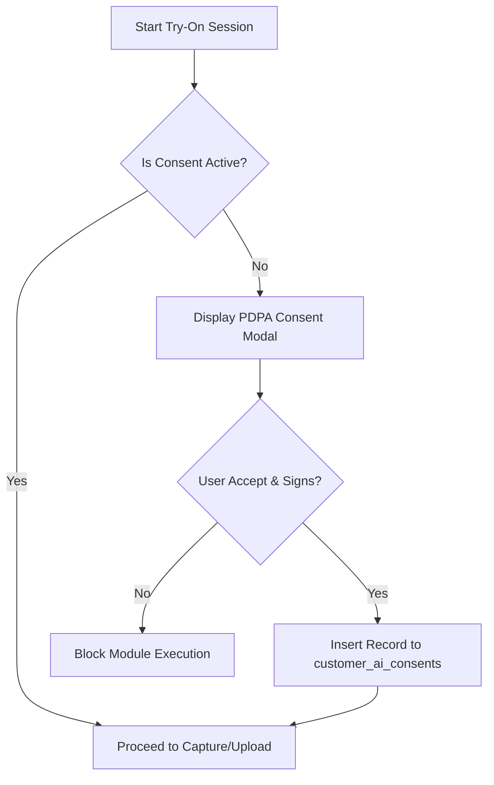

# Privacy & Compliance Policy — AI Try-On Studio

This document defines privacy strategies, PDPA (Personal Data Protection Act) compliance rules, storage bucket configuration, and audit policies for handling customer image files within the **AI Virtual Try-On Studio** module.

---

## 1. Personal Data Protection Act (PDPA) Compliance

Customer photographs contain highly sensitive personal biometric indicators (facial features, skin tones, hair patterns, and bodily proportions). Therefore, processing these images through external AI models requires strict adherence to PDPA regulations in Thailand.

### Consent Workflow Engine



1. **Explicit Agreement**: The system displays a dedicated AI Processing Consent Form explaining:
   * Why photographs are captured.
   * Which external systems process the images (e.g. Fal.ai, Fashn).
   * Data retention terms (unselected trials deleted in 30 days).
   * The customer's right to withdraw consent and request immediate deletion of their files.
2. **Digital Signature**: The staff must capture either:
   * A digital signature drawn by the customer on a tablet/mobile screen.
   * A physical paper consent form scan uploaded directly to the database.
3. **Revocation Handlers**: When a customer revokes their consent:
   * The status is updated to inactive in `customer_ai_consents`.
   * A server-side transaction deletes all associated source photographs and trial result files from Supabase Storage.

---

## 2. Storage Bucket Strategy & Security

To prevent unauthorized web scraping or data leaks, all image folders are configured under a **Private Storage Bucket** in Supabase.

### Folder Structure Configuration

```
/private/
  ├── customer-source-images/
  │   └── [customer_uuid]/
  │       └── [media_uuid]_source.jpg
  ├── ai-tryon-results/
  │   └── [session_uuid]/
  │       └── [result_uuid]_output.png
  ├── ai-consent-documents/
  │   └── [customer_uuid]/
  │       └── [consent_uuid]_signature.png
```

### Security Policy Rules (RLS on Storage)

Public access to these buckets is disabled. Retrieval is allowed exclusively through **Temporary Signed URLs** generated dynamically by the server.

* **URL Expiry**: Signed URLs will have a short expiration period of **10 minutes (600 seconds)**.
* **RLS Policies**:
  * `INSERT` rules require users to be authenticated staff profiles.
  * `SELECT` rules verify the authenticated session matches an active staff member with `ai_tryon.view` permissions.

---

## 3. Image Metadata Scrubbing

Mobile device uploads typically bundle extensive EXIF metadata (geographic GPS locations, camera parameters, timestamps, and device brands). To protect client privacy, the system scrubs this metadata during the upload process.

* **Client-Side Compression**: The `<CameraCapture />` component draws images onto a canvas to resize them. This canvas drawing process automatically strips all original EXIF metadata.
* **Server-Side Sanitation**: In cases of file uploads bypassing canvas rendering, the upload route uses a server-side filter to verify and remove non-image headers before storage write.

---

## 4. Access Logs & Audit System

Every action touching raw client photos must write an entry to `audit_logs`.

| Action | Log Entry Description |
| :--- | :--- |
| `VIEW_SOURCE_IMAGE` | Logged whenever a signed URL is requested for a customer's original photo, detailing the staff member who accessed it. |
| `UPLOAD_SOURCE_IMAGE` | Logs the file size, resolution, and ID of the newly added customer photograph. |
| `SIGN_CONSENT` | Logs the signature timestamp and client IP address. |
| `EXPORT_TRYON` | Logs whenever a staff member downloads a generated suit render. |
| `DELETE_TRYON_SESSION` | Logs the deletion of trial session assets. |
